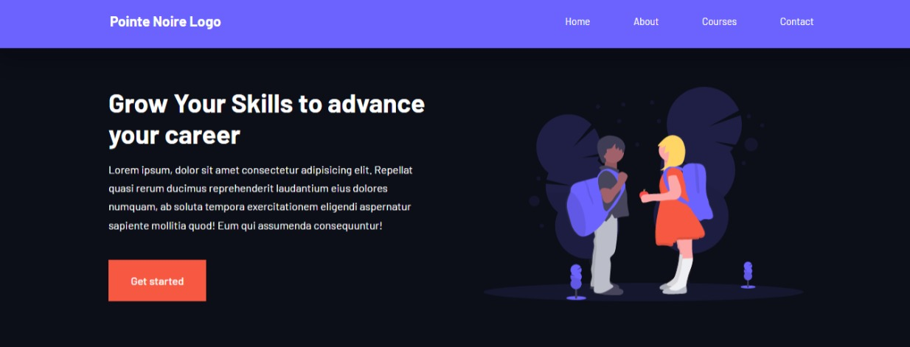

This is a solution to building an Online African IT School

## Table of contents

- [Overview](#overview)
  - [The challenge](#the-challenge)
  - [Screenshot](#screenshot)
  - [Links](#links)
- [My process](#my-process)
  - [Built with](#built-with)
  - [What I learned](#what-i-learned)
  - [Continued development](#continued-development)
  - [Useful resources](#useful-resources)
- [Author](#author)
- [Acknowledgments](#acknowledgments)


## Overview

### The challenge

After completing the site, 
users should be able to:

- View the optimal layout for each of the website's pages depending on their device's screen size
- Use the fully functioning contact form to contact the School
- See hover states for all interactive elements on the page
- View each page and be able to toggle between the tabs to see new information

### Screenshot
I added a screenshot of my solution here.




### Links

- Live Site URL: [Add live site URL here](https://pnitschool.netlify.app/)

## My process

### Built with

- Semantic HTML5 markup
- CSS custom properties
- Flexbox
- CSS Grid
- Mobile-first workflow
- JavaScript


### What I learned

I Used this section to recap over some of my major learnings while working through this project. Writing these out and providing code samples of areas i wanted to highlight.

Doing this project:

* I learned to Use Third Party API like Swiper Js for Testimonials slide
* I learned to build a responsive faqs section
* I learned to build a fully functioning contact form
* I learned to design a web responsive site 
* I learned to design a website accessible to different types of users.
* I used intensively CSS GRID LAYOUT.
* I learned how to build multiples pages website and connect them using JavaScript


```css
/* for someone who is visually impaired */
Made sure to implement this content for only screen readers to help users without vision.
.sr-only{
    position: absolute;
    width:1px;
    height: 1px;
    padding: 0;
    margin: -1px;
    overflow: hidden;
    clip: rect(0,0,0,0);
    white-space: nowrap;
    border: 0;
}

.testimonial_body::before{
    content: "";
    display: block;
    background: linear-gradient(
        135deg,
        transparent, 
        var(--color-primary),
        var(--color-primary));
    width: 3rem;
    height: 3rem;
    position: absolute;
    left: 50%;
    top: -1.5rem;
    transform: rotate(45deg);
}
```
```js
const faqs= document.querySelectorAll('.faq');

faqs.forEach(faq=>{
    faq.addEventListener('click', ()=>{
        faq.classList.toggle('open')

        const icon= faq.querySelector('.faq_icon i');
        if(icon.className === 'uil uil-plus-circle'){
            icon.className= "uil uil-minus"
        } else{
            icon.className = "uil uil-plus-circle"
        }
    })
})
```

### Continued development
However, I need to build website using even better codes
I need to learn how to build the same site using frameworks such as: React and Vue


### Useful resources

- [Example resource 1](https://www.youtube.com/kepowob) - This helped me learn how to better use CSS GRID. I really liked this pattern and will use it going forward.

## Author

- Website - [Chrys-Bimokono](https://chrysbim.com/index.html)

- Twitter - [@EnockBim](https://twitter.com/home)


## Acknowledgments
I really give thanks to the frontend community for their support and encouragement.


